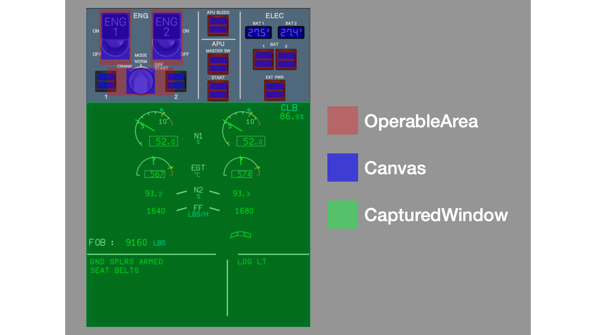

# Virtual Instrument Panel

fsmapper provides the capability to flexibly construct a virtual instrument panel on a sub display.
When combined with a touchscreen-enabled display, it allows for a diverse range of aircraft controls beyond what can be achieved with your physical input devices alone. 
This functionality is particularly designed with the following aspects in mind.

- Ability to seamlessly integrate FS2020 instrument windows that are popped out using **`[Right Alt]`** + **`[Mouse Click]`** as part of the virtual instrument panel with a natural appearance.

- Not only does it have the capability to display and interact with different virtual instrument panels for each aircraft, but it also allows for dynamically switching between multiple panels within a single aircraft.

These features enable the utilization of smaller screens, such as tablets, without the necessity for large secondary monitors (like this [video](https://www.youtube.com/watch?v=oaI1DVXfHqY)).

:::note
The motivation and drive behind creating fsmapper was precisely to achieve this feature.<br/>
Towards the end of 2020, when I decided to DIY [this device](https://github.com/opiopan/simhid-g1000) for FS2020, I started researching which software would be most suitable for controlling the display. 
Unfortunately, I couldn't find any software capable of this at the time.

Ultimately, this led to the decision to DIY the software as well.
:::

## Components for Virtual Instrument Panel

The virtual instrument panel comprises a combination of three hierarchical objects:

- **Viewport:**<br/>
    Represents the rectangular area in the screen space of the Windows where the virtual instrument panel is displayed. It's practically a transparent [**Layered Window**](https://learn.microsoft.com/en-us/windows/win32/winmsg/window-features#layered-windows) placed within this rectangular area.

- **View:**<br/>
    Holds the content displayed on the **Viewport** and handles touch interactions. Multiple **View**s can belong to a **Viewport**, but only one of them is displayed or receives touch events, referred to as the **current View**.

- **View Element:**<br/>
    A sub-component of the **View**, designed to simplify the rendering process and touch interactions. The FS2020 instrument window that pops out with **`[Right Alt]`** + **`[Mouse Click]`** can also serve as a **View Element** within the configuration of the **View**.

As an example, in [this sample script](/samples/a32nx), the relationships between each object will be explained.


This script divides the entire sub-display into three viewports.<br/>
Viewport 3 has only one view and acts as an indicator showing which view the other two viewports are displaying.<br/>
Viewport 1 and Viewport 2 each contain five views with FS2020's pop-out instrument windows for six displays of the A320 (FCU, PFD, ND, ECAM x 2, MCDU).
Users can freely switch between the content of these two views.<br/>

In this way, combining viewports and views allows for the creation of a flexible instrument panel.

Let's now see how each view combines view elements to form its composition.



View elements consist of three types: 
the [`OperableArea`](/libs/mapper/OperableArea) object, indicating touch-operable regions; 
the [`Canvas`](/libs/mapper/Canvas) object, delineating drawable areas and holding rendering logic; 
and the [`CapturedWindow`](/libs/mapper/CapturedWindow) object, treating windows from other processes, like FS2020's pop-out instruments, as view elements.

Given that operational changes often reflect visually, such as indicator lamps on buttons, [`OperableArea`](/libs/mapper/OperableArea) and [`Canvas`](/libs/mapper/Canvas) commonly overlap as illustrated above.

Please focus on the upper ECAM display placed in the view as a [`CapturedWindow`](/libs/mapper/CapturedWindow). 
Notice that unlike when popping out a window in FS2020, the title bar and window frame are hidden, seamlessly integrating into the instrument panel.
This illustrates how fsmapper actively manages the state of windows from other processes, captured as CapturedWindows, enhancing their utility as components within the view.

:::info
fsmapper utilizes a [**WH_CALLWNDPROC** global hook](https://learn.microsoft.com/en-us/windows/win32/winmsg/about-hooks#wh_callwndproc-and-wh_callwndprocret) to perform DLL injection into processes like fs2020.
This hook enables the replacement of message response processing, alongside [hooking certain Win32 APIs](https://github.com/opiopan/fsmapper/blob/v0.9.1/src/hook/hookdll.cpp#L339-L340), facilitating control over portions of the view and managing visibility in coordination with view switching.

It seems that FS2020's pop-out windows require this special treatment; otherwise, it's not possible to control the appearance, position, and size of the window as intended without these measures.
:::

The conceptual explanation of **Viewport**, **View**, and **View Elements** concludes here, and the explanation will now focus on how to define them in Lua scripts.

### Viewport
The definition of a **Viewport** is accomplished by creating a [`Viewport`](/libs/mapper/Viewport) object using [`mapper.viewport()`](/libs/mapper/mapper_viewport). 
At this point, the crucial parameter is the information regarding which area of the screen it occupies, specified by the display number and additional information,　and there are several ways to define it as follows.

```lua
-- Viewport that covers the entire the display 2
local viewport1 = mapper.viewport{
    name = 'Viewport 1',
    diplayno = 2,
}

-- Relative specification:
-- Viewport that occupies the right half of the display 3
local viewport2 = mapper.viewport{
    name = 'Viewport 2'
    diplayno = 3,
    x = 0.5, y = 0,
    width = 0.5, y = 1,
}

-- Pixel-based specification: 
-- Viewport that occupies a 100px x 100px area at the top-left of the display 3
local viewport3 = mapper.viewport{
    name = 'Viewport 3'
    diplayno = 3,
    coordinate = 'absolute',
    x = 0, y = 0,
    width = 100, y = 100,
}
```

Defining the viewport alone doesn't make it effective. Once all viewport definitions that constitute the virtual instrument panel are completed, you activate them with [`mapper.start_viewports()`](/libs/mapper/mapper_start_viewports).


```lua
mapper.start_viewports()
```

Once you invoke [`mapper.start_viewports()`](/libs/mapper/mapper_start_viewports), you can't define new viewports. If you want to display another virtual instrument panel, call [`mapper.reset_viewports()`](/libs/mapper/mapper_reset_viewports) to remove all defined viewports.

```lua
mapper.reset_viewports()
```

### View Element
The creation of [`OperableArea`](/libs/mapper/OperableArea) objects is done using [`mapper.view_elements.operable_area()`](/libs/mapper/mapper_view_elements_operable_area).
The parameters involve specifying the type of corresponding touch action and the [**Event ID**](/guide/event-action-mapping#event) that triggers when that action is detected. Further details are explained in the [**Handle Touch Event**](#handle-touch-event).

```lua
local tapped = mapper.register_event('tapped on the view')
local operable_area = mapper.view_elements.operable_area{event_tap = tapped}
```

The creation of [`Canvas`](/libs/mapper/Canvas) objects is done using [`mapper.view_elements.canvas()`](/libs/mapper/mapper_view_elements_canvas).
The crucial parameters include the rendering function (`renderer`) responsible for the drawing process and the initial value of the user-defined context that determines the drawing content (`value`).
Further details are explained in the [**Render on the View**](#render-on-the-view).

```lua
local canvas = mapper.view_elements.canvas{
    value = true,
    renderer = function (rctx, value)
        -- Here is the drawing code
    end
}
```

The creation of [`CapturedWindow`](/libs/mapper/CapturedWindow) objects is done using [`mapper.view_elements.captured_window()`](/libs/mapper/mapper_view_elements_captured_window).
The parameters involve specifying the name displayed on the dashboard and the title text of the window to capture. 
Refer to the [**Handle Popped-out Windows**](#handle-poped-out-windows) for related information.

```lua
local captured_window = mapper.view_elements.captured_window{
    name = "G1000 PFD",
    window_title="AS1000_PFD"
}
```
### View
**Views** are defined using the [`register_view()`](/libs/mapper/Viewport/Viewport-register_view) method of the [`Viewport`](/libs/mapper/Viewport) object. Parameters include the name of the view (`name`), a list of view elements comprising the view (`elements`), and associated [**Event-Action mappings**](/guide/event-action-mapping) for the view (`mappings`). Often, a background image (`background`) is specified as the base for the view.

```lua
local view_id = viewport3:register_view{
    name = 'my_view',
    background = graphics.bitmap('assets/view3.png'),
    elements = {
        {object=operable_area, x=0, y=0, width=100, height=50},
        {object=canvas, x=0, y=0, width=100, height=50},
        {object=captured_window, x=0, y=50, width=100, height=50},
    },
    mappings = {{event=tapped, action = fs2020.rpn_executer('(>K:XPNDR_IDENT_ON)')}
    }
}
```

[`Viewport:register_view()`](/libs/mapper/Viewport/Viewport-register_view) returns a unique identifier for the view known as the **View ID**.
When registering multiple views within a viewport, it's essential to keep track of the **View ID** for each view.
To change the current view within the viewport, set the **View ID** to the [`current_view`](/libs/mapper/Viewport/Viewport_current_view) property of the [`Viewport`](/libs/mapper/Viewport) object or use the [`change_view()`](/libs/mapper/Viewport/Viewport-change_view) method.

```lua
viewport.current_view = view_ids[2]
```

## Coordinate System

### Relative Coordinates VS. Absolute Coordinates

### Allignment

## Z-order

## Render on the View

## Handle Poped out Windows

## Handle Touch Event

## Hidden Viewport

